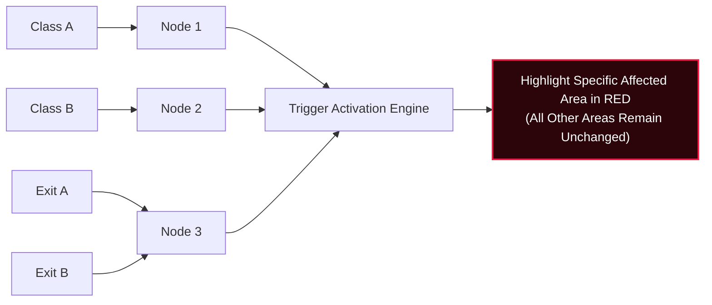

# 3D Isometric Campus Model — Node-Based Classroom Telemetry System

An interactive 3D digital twin and node-based telemetry monitoring system built with **React 19**, **Vite**, **TypeScript**, and **Tailwind CSS**.

---

## 🌟 Architecture & Node Mapping

| Area / Zone | Assigned Node | Telemetry Function |
| :--- | :--- | :--- |
| **Class A** | **Node 1** | Primary West Wing classroom sentinel |
| **Class B** | **Node 2** | Primary East Wing lab classroom sentinel |
| **Exit A & Exit B** | **Node 3** | Dual Exit Controller Hub monitoring South & North portals |

---

## ⚡ System Flow & Isolation Logic



### Trigger Condition Rule
> **When a trigger is activated, identify the specific affected class/area and highlight that area in RED.**
> The red highlight appears **only** on the specific class/area where the trigger is detected, while all other areas remain unchanged.

---

## 🚀 Key Features

1. **3D Isometric Campus Map**:
   - Vector SVG isometric projection with architectural details, classroom furniture, and IoT sensor chips.
   - Distinct alert shaders: affected rooms flash vivid neon red (`#ff1744`) with expanding radar ripples, while non-affected zones maintain calm teal/emerald secure styling.
   - Dynamic evacuation pathway rerouting when an exit is compromised.

2. **Node Architecture Flow Diagram**:
   - Interactive flow pipeline tracing signals from physical campus spaces to assigned nodes and downstream highlight logic.
   - Animated data packets that accelerate into red alert pulses along the triggered conduit.

3. **Trigger Matrix & Simulation**:
   - 1-click trigger triggers for **Class A**, **Class B**, **Exit A**, **Exit B**, and **Both Exits**.
   - **Automated Demo Walkthrough**: 5-step automated sequence cycling through all areas to verify isolated highlighting.
   - Customizable trigger events (Smoke/Fire, Emergency SOS, CO₂ spike, Intrusion, Manual Drill).
   - Audio feedback synthesizer (Web Audio API) with mute toggle.

4. **Multi-View Modes**:
   - 🌐 **3D Isometric Map**
   - 🔀 **Flow Architecture**
   - ⚡ **Split Dual View**

---

## 🛠️ Getting Started Locally

### Prerequisites
- Node.js (v18+)
- npm or pnpm

### Installation

1. **Clone the repository**:
   ```bash
   git clone https://github.com/swaraliii19/isometric-campus-model.git
   cd isometric-campus-model
   ```

2. **Install dependencies**:
   ```bash
   npm install
   ```

3. **Start development server**:
   ```bash
   npm run dev
   ```

4. **Build for production**:
   ```bash
   npm run build
   ```

---

## 📄 License
MIT License.
