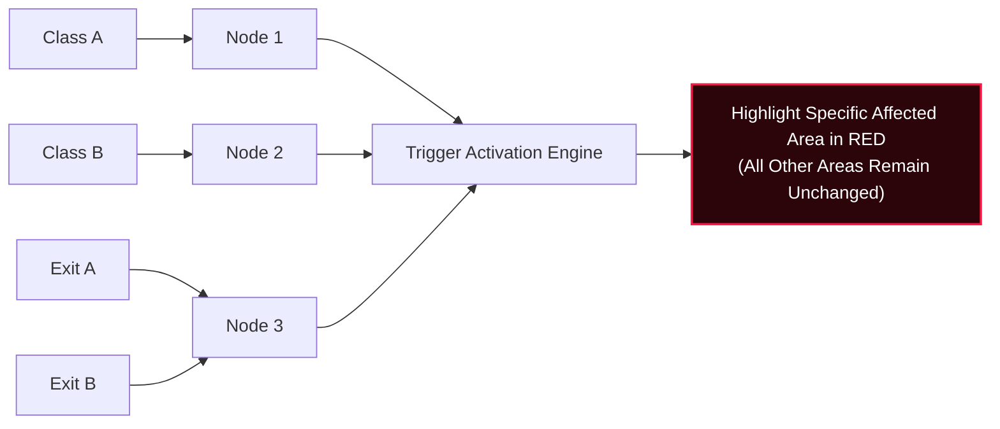

# ResQMesh Command Center — 3D Digital Twin & Telemetry Dashboard

An emergency command center, 3D isometric digital twin, and node-based telemetry monitoring system built with **React 19**, **Vite**, **TypeScript**, **Tailwind CSS**, **FastAPI**, and **Firebase (Cloud Firestore + Realtime Database Dual-Sync)**.

---

## 🗂️ Project Structure

The project is cleanly decoupled into **Frontend** (optimized for **Vercel**) and **Backend** (optimized for **Render**):

```text
rescue-dashboard/
├── backend/                  # Python FastAPI Backend (Deploy to Render)
│   ├── main.py               # REST API, AI hazard assessment, and telemetry engine
│   ├── requirements.txt      # Python dependencies
│   ├── Procfile              # Render / Web server process runner
│   └── README.md             # Backend setup & deployment guide
│
├── src/                      # React 19 Frontend (Deploy to Vercel)
│   ├── components/           # 3D Isometric Map, Flow Diagram, Header, Controls, Logs
│   ├── services/             # API client for Render backend
│   ├── utils/                # Audio synthesizer & sound controller
│   ├── firebase-sync.js      # Dual-sync (Cloud Firestore + Realtime Database)
│   ├── App.tsx               # Main Command Center UI & state dispatcher
│   └── main.tsx              # React entrypoint
│
├── render.yaml               # Infrastructure blueprint for 1-click Render deployment
├── vercel.json               # SPA rewrite configuration for Vercel deployment
├── vite.config.ts            # Clean Vite 8 bundler configuration
└── package.json              # Frontend dependencies and build scripts
```

---

## 🚀 Deployment Instructions

### 1. Deploy Frontend to Vercel
1. Log in to [Vercel](https://vercel.com/) and click **Add New...** → **Project**.
2. Import your GitHub repository: `ChaitanyaPalve/rescue-dashboard`.
3. Vercel automatically detects **Vite** using the included [`vercel.json`](./vercel.json).
   - **Framework Preset**: Vite
   - **Build Command**: `npm run build`
   - **Output Directory**: `dist`
4. Under **Environment Variables**, optionally set:
   - `VITE_BACKEND_URL`: `https://your-backend-app.onrender.com`
5. Click **Deploy**!

### 2. Deploy Backend to Render
1. Log in to [Render Dashboard](https://dashboard.render.com/).
2. Click **New +** → **Blueprint** (or **Web Service**).
3. Connect your repository: `ChaitanyaPalve/rescue-dashboard`.
4. Render will read [`render.yaml`](./render.yaml):
   - **Root Directory**: `backend`
   - **Build Command**: `pip install -r requirements.txt`
   - **Start Command**: `uvicorn main:app --host 0.0.0.0 --port $PORT`
5. Click **Apply** or **Create Web Service**!

---

## 🌟 Node & Classroom Mapping

| Area / Zone | Assigned Node | Node ID Keys | Telemetry & Role |
| :--- | :--- | :--- | :--- |
| **Class A** | **Node 1** | `node1`, `node001`, `node-1` | West Wing classroom sentinel: **Temperature** & **Gas/Smoke/CO₂** |
| **Class B** | **Node 2** | `node2`, `node002`, `node-2` | East Wing lab classroom sentinel: **Temperature**, **Gas**, & **Motion (`accelX`)** |
| **Exit A & Exit B** | **Node 3** | `node3`, `node003`, `node-3` | **Dual Exit Controller Hub**: Monitors South (Exit A) & North (Exit B) portals, and counts **People Inside** |

---

## ⚡ System Flow & Isolation Logic



---

## 🛠️ Local Development

### Run Frontend
```bash
npm install
npm run dev
```
Open [http://localhost:3000](http://localhost:3000)

### Run Backend
```bash
cd backend
pip install -r requirements.txt
uvicorn main:app --reload --port 8000
```
Open [http://localhost:8000/docs](http://localhost:8000/docs)
